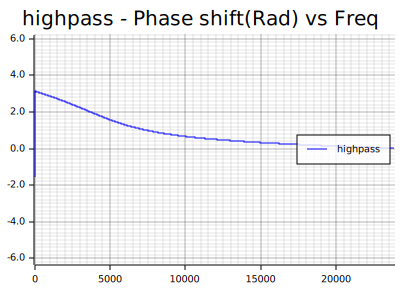

# Audio filters in Rust
A port of the WebAudio API filters to Rust.

## Description 
Audio or DSP filters, allow you to attenuate or accentuate some frequencies or range of frequencies in a signal. The signal can be of any kind, but in here, we will focus on 1D signals. Like audio signals. There can also occur differences in the signal phases, that vary with the filter and the frequency components of the signal. <br>
This is a port of Audio filters, from Python to Rust. My port was made from TheAlgorithms GitHub in Python (see references below). That is, by it self a port from WebAudio API C++ filters implementation used by the browsers. <br>


## The following filters are implemented over a BiQuad IIR filter
1. **lowpass**
2. **highpass**
3. **bandpass**
4. **allpass**
5. **peak**
6. **lowshelf**
7. **highshelf** 


## Plots of the filters Gain (dB) and phase shift response 

### lowpass - freq = 5.000 Hz - sample_rate = 48.000 samples/sec 


 <br>

### highpass - freq = 5.000 Hz - sample_rate = 48.000 samples/sec


 <br>


### bandpass - freq = 10.000 Hz - sample_rate = 48.000 samples/sec - q_factor = 1.0


 <br>

### allpass - freq = 10.000 Hz - sample_rate = 48.000 samples/sec


 <br>

### peak - freq = 10.000 Hz - sample_rate = 48.000 samples/sec - gain = 6 dB


 <br>

### lowshelf - freq = 10.000 Hz - sample_rate = 48.000 samples/sec - gain = 6 dB


 <br>

### highshelf - freq = 10.000 Hz - sample_rate = 48.000 samples/sec - gain = 6 dB


 <br>


## How to run the code 
```
To make a project for this files do:
    -Install Rust your computer (Linux, Win, Mac, Raspberry Pi).
     
    cargo new audio_filters_in_rust
    cd audio_filters_in_rust
     
    -Copy the repository files to this directory and overlap them.
 
To compile do:
    cargo build --release
 
To run do:
    cargo run --release
 
to run the tests do:
    cargo test
```


## References:

1. **GitHub - TheAlgorithms / Python / audio_filters** <br>
   [https://github.com/TheAlgorithms/Python/tree/master/audio_filters](https://github.com/TheAlgorithms/Python/tree/master/audio_filters)

2. **Good resources on DSP** – Digital Signal Processing <br> 
   [https://github.com/joaocarvalhoopen/How_to_learn_modern_electronics#dsp--digital-signal-programming](https://github.com/joaocarvalhoopen/How_to_learn_modern_electronics#dsp--digital-signal-programming)

3. **WebAudio API - Mozilla Docs** <br>
   [https://developer.mozilla.org/pt-BR/docs/Web/API/Web_Audio_API](https://developer.mozilla.org/pt-BR/docs/Web/API/Web_Audio_API)
  
4. **Audio Filters - Theory and Practice** <br>
   by Ethan Winer <br>
   [http://ethanwiner.com/filters.html](http://ethanwiner.com/filters.html)

5. **Audio filter - Wikipedia** <br>
   [https://en.wikipedia.org/wiki/Audio_filter](https://en.wikipedia.org/wiki/Audio_filter)

6. **Electronic filter - Wikipedia** <br>
   [https://en.wikipedia.org/wiki/Electronic_filter](https://en.wikipedia.org/wiki/Electronic_filter)

7. **How to learn modern Rust** <br>
   [https://github.com/joaocarvalhoopen/How_to_learn_modern_Rust](https://github.com/joaocarvalhoopen/How_to_learn_modern_Rust)

## License

* **MIT Open Source License**, like the original license from <br>
  GitHub - TheAlgorithms / Python / audio_filters <br>
  [https://github.com/TheAlgorithms/Python/tree/master/audio_filters](https://github.com/TheAlgorithms/Python/tree/master/audio_filters)


## Have fun!
Best regards, <br>
Joao Nuno Carvalho

